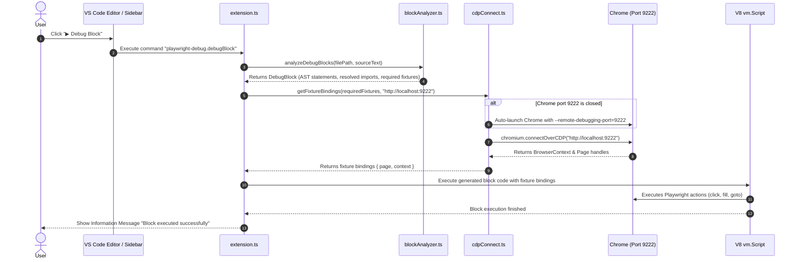

# 🏗 Playwright Debug Block — Architecture & Technical Design

This document details the internal design, component relationships, AST analysis engine, and execution pipeline of the **Playwright Debug Block** VS Code extension.

---

## 📐 High-Level Architecture Overview

```
 ┌────────────────────────────────────────────────────────────────────────┐
 │                           VS CODE EXTENSION                            │
 │                                                                        │
 │  ┌──────────────────────┐               ┌───────────────────────────┐  │
 │  │  CodeLens Provider   │               │   Sidebar TreeView        │  │
 │  │ (codeLensProvider.ts)│               │    (blockTreeView.ts)     │  │
 │  └──────────┬───────────┘               └─────────────┬─────────────┘  │
 │             │                                         │                │
 │             └───────────────────┬─────────────────────┘                │
 │                                 ▼                                      │
 │                     ┌───────────────────────┐                          │
 │                     │     extension.ts      │ (Command Dispatcher)     │
 │                     └───────────┬───────────┘                          │
 │                                 │                                      │
 │                                 ▼                                      │
 │                     ┌───────────────────────┐                          │
 │                     │   blockAnalyzer.ts    │ (TypeScript AST Engine)  │
 │                     └───────────┬───────────┘                          │
 │                                 │                                      │
 │                                 ▼                                      │
 │                     ┌───────────────────────┐                          │
 │                     │   codeGenerator.ts    │ (Transpilation & Wrap)   │
 │                     └───────────┬───────────┘                          │
 │                                 │                                      │
 │       ┌─────────────────────────┴────────────────────────┐             │
 │       ▼                                                  ▼             │
 │ ┌──────────────┐                                ┌─────────────────┐    │
 │ │cdpConnect.ts │                                │ Node vm.Script  │    │
 │ └──────┬───────┘                                └────────┬────────┘    │
 └────────┼─────────────────────────────────────────────────┼─────────────┘
          │ (CDP WebSocket Port 9222)                       │ (Executes code)
          ▼                                                 ▼
┌──────────────────┐                               ┌─────────────────┐
│ Active Chrome    │◄──────────────────────────────┤ Fixture Bindings│
│ (Remote Debugging│                               │ (page, context) │
└──────────────────┘                               └─────────────────┘
```

---

## 🧩 Core Subsystems & Components

### 1. **Block Detection & AST Analysis Engine (`src/blockAnalyzer.ts`)**
Instead of relying on fragile regular expressions or string splits, the extension uses the official **TypeScript Compiler API** (`typescript` module) to analyze target files:
* **Comment Marker Extraction**: Extracts block ranges using flexible regex matching for `// debug:block <name>` (or `// @pw-debug:block <name>`) and `// debug:end` / `// @pw-debug:end`.
* **AST Statement Extraction**: Traverses the `ts.SourceFile` AST to find all statements that fall strictly between the comment line boundaries.
* **Recursive Dependency Resolution**:
  * Scans all statements inside the block for free identifiers (variables, classes, functions referenced but declared outside the block).
  * Uses `ts.createProgram` and `ts.TypeChecker` to resolve each symbol to its `valueDeclaration`.
  * Recursively resolves dependent top-level helper functions, Page Object Model (POM) classes, and local variable declarations.
  * Capped at **depth 10** to prevent infinite loops on recursive references.
* **Fixture Detection**: Identifies references to standard Playwright test fixtures (`page`, `context`, `browser`, `request`) within the block and dependent methods.
* **Side-Effect Flagging**: Detects potential side-effect operations (`await page.goto`, `click`, `fill`, network requests) and warns the user if side-effects might alter state unexpectedly.

### 2. **Chrome DevTools Protocol (CDP) Bridge (`src/cdpConnect.ts` & `src/chromeLauncher.ts`)**
* **CDP Connection**: Uses `playwright-core`'s `chromium.connectOverCDP('http://localhost:9222')` to attach to an active Chrome browser session.
* **Fixture Extraction**:
  * Extracts active `browser`, `context`, and `page` instances from the CDP connection.
  * Auto-creates a new tab (`context.newPage()`) if Chrome has no open tabs.
* **Auto-Launcher (`src/chromeLauncher.ts`)**:
  * Detects OS platform (Windows, macOS, Linux).
  * Locates the local Chrome binary path.
  * Spawns Chrome with `--remote-debugging-port=9222` and `--user-data-dir` if connection to port 9222 fails.

### 3. **Code Generator & VM Execution (`src/codeGenerator.ts` & `src/extension.ts`)**
* **Transpilation**: Uses `ts.transpileModule` to compile TypeScript AST code and resolved dependencies into valid CommonJS ES2022 JavaScript code.
* **Function Wrapping**: Wraps the compiled code inside an exported debug function:
  ```javascript
  module.exports = async function(__pw_fixtures) {
    const { page, context, browser, request } = __pw_fixtures;
    // Resolved dependencies (POM classes, top-level helper functions)
    // Block statements execution
  };
  ```
* **V8 `vm.Script` Isolation**: Loads the wrapped code into Node's `vm.Script` context with custom module require hooks (`setupModuleHooks`), executing only the block code with live Playwright fixture bindings.

### 4. **User Interface Components (`src/codeLensProvider.ts` & `src/blockTreeView.ts`)**
* **`PlaywrightDebugCodeLensProvider`**: Implements `vscode.CodeLensProvider` to scan active TypeScript/JavaScript documents and inject a `▶ Debug Block` button above tagged code blocks.
* **`PlaywrightDebugTreeDataProvider`**: Implements `vscode.TreeDataProvider` for the **Debug Blocks** sidebar view. Lists open files and their tagged blocks with line numbers and fixture dependencies.

---

## 🔄 End-to-End Execution Sequence



---

## ⚙️ Module Resolution & Hooking Architecture

Because test files may import relative modules (e.g. `import { LoginPage } from '../pages/loginPage'`), the extension sets up custom module resolution hooks during activation (`setupModuleHooks` in `src/extension.ts`):
1. **Module `.ts` Compiler Hook**: Intercepts `require.extensions['.ts']` so that relative TypeScript files required inside the `vm.Script` context are dynamically transpiled on the fly.
2. **`Module._resolveFilename` Interceptor**: Intercepts Node's module path resolution so that extensions omitting `.ts` (or requesting `.js` when a `.ts` file exists) automatically resolve to the source TypeScript file.

---

## 🛠 Tech Stack

* **VS Code Extension API**: `^1.85.0`
* **Playwright / Playwright-Core**: `^1.63.0`
* **TypeScript Compiler API**: `^5.3.0`
* **Node.js V8 `vm` module**: Built-in runtime sandbox
